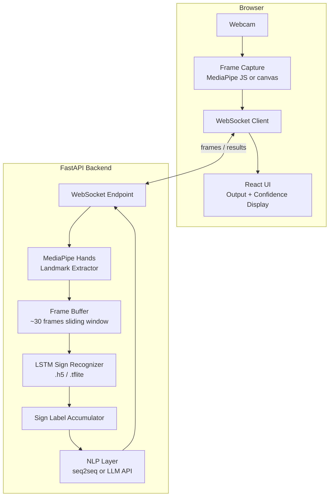

# Design Document: ASL to English Translator

## Overview

The ASL to English Translator is a two-stage ML pipeline embedded in a React + FastAPI web application. The user signs in front of their webcam; the browser streams frames to the backend, which extracts hand landmarks with MediaPipe, feeds a sliding window of landmark sequences into a trained LSTM model to produce sign labels, then passes those labels through an NLP layer to produce grammatical English sentences.

The two-stage design separates concerns cleanly:
- Stage 1 (LSTM): raw landmark sequences → discrete sign labels
- Stage 2 (NLP): sign label sequences → grammatical English sentences

Training is done offline (Google Colab / Kaggle) using the ASL Citizen dataset. Only the trained model artifact (`.h5` or `.tflite`) is deployed to the backend.

---

## Architecture



The frontend sends raw video frames (JPEG-encoded) over a WebSocket. The backend processes each frame, accumulates a 30-frame window, runs the LSTM when the window is full, appends the resulting sign label to the label accumulator, and periodically flushes the accumulator through the NLP layer to produce an English sentence fragment. Results (sign label, confidence score, current English text) are pushed back to the frontend over the same WebSocket.

---

## Components and Interfaces

### 1. React Frontend (`frontend/`)

Responsibilities:
- Access the user's webcam via `getUserMedia`
- Encode frames as JPEG and send over WebSocket at ≥15 fps
- Render the live camera preview
- Display the current English output buffer, confidence score, and status messages
- Provide Start / Pause / Stop session controls

Key interfaces:
```typescript
// Message sent to backend
interface FrameMessage {
  type: "frame";
  sessionId: string;
  frameData: string; // base64-encoded JPEG
  timestamp: number;
}

// Message received from backend
interface TranslationResult {
  type: "result";
  signLabel: string | null;
  confidence: number;
  englishText: string;
  status: "active" | "paused" | "no_hand" | "low_confidence" | "error";
}
```

### 2. FastAPI Backend (`backend/`)

#### 2a. WebSocket Endpoint (`/ws/{session_id}`)
- Accepts `FrameMessage`, dispatches to the pipeline
- Sends `TranslationResult` back to the client
- Manages per-session state (frame buffer, label accumulator, session status)

#### 2b. Landmark Extractor (`landmark_extractor.py`)
- Wraps MediaPipe Hands
- Input: raw JPEG bytes
- Output: `LandmarkFrame` (21 landmarks × 3 coords = 63 floats) or `None` if no hand detected

#### 2c. Frame Buffer (`frame_buffer.py`)
- Sliding window of the last N frames (default N=30)
- Emits a complete window when full; advances by a configurable stride

#### 2d. LSTM Sign Recognizer (`sign_recognizer.py`)
- Loads `.h5` / `.tflite` model at startup
- Input: `(30, 63)` float32 tensor
- Output: `(sign_label: str, confidence: float)`
- Discards predictions with confidence < 0.6

#### 2e. Sign Label Accumulator (`label_accumulator.py`)
- Maintains the ordered list of emitted sign labels for the current session
- Handles special labels: `SPACE`, `DELETE`
- Exposes the current label sequence for NLP consumption

#### 2f. NLP Layer (`nlp_layer.py`)
- Input: list of sign labels
- Output: grammatical English sentence string
- Implementation: seq2seq model or LLM API call (e.g., OpenAI)
- Triggered after each new sign label is appended (or on a short debounce timer)

#### 2g. Session Manager (`session_manager.py`)
- Tracks active sessions keyed by `session_id`
- Handles start / pause / resume / stop lifecycle
- Cleans up resources on stop

### 3. ML Model Artifacts (`models/`)

| File | Description |
|------|-------------|
| `sign_recognizer.h5` | Trained Keras LSTM model |
| `label_encoder.json` | Maps integer class indices to sign label strings |
| `nlp_model/` | Optional: local seq2seq weights (if not using LLM API) |

---

## Data Models

```python
from dataclasses import dataclass, field
from typing import Optional
from enum import Enum

class SessionStatus(Enum):
    IDLE = "idle"
    ACTIVE = "active"
    PAUSED = "paused"
    STOPPED = "stopped"

@dataclass
class LandmarkFrame:
    """63 floats: 21 landmarks × (x, y, z)"""
    coords: list[float]  # length == 63
    timestamp: float

    def is_valid(self) -> bool:
        return len(self.coords) == 63

@dataclass
class SignPrediction:
    label: str
    confidence: float  # 0.0 – 1.0

@dataclass
class SessionState:
    session_id: str
    status: SessionStatus = SessionStatus.IDLE
    frame_buffer: list[LandmarkFrame] = field(default_factory=list)
    label_sequence: list[str] = field(default_factory=list)
    english_text: str = ""
    last_confidence: float = 0.0

@dataclass
class TranslationResult:
    sign_label: Optional[str]
    confidence: float
    english_text: str
    status: str  # maps to SessionStatus or special values
```

TypeScript mirror (frontend):
```typescript
interface LandmarkFrame {
  coords: number[]; // length 63
  timestamp: number;
}

interface SessionState {
  sessionId: string;
  status: "idle" | "active" | "paused" | "stopped";
  englishText: string;
  lastConfidence: number;
}
```

---

## Correctness Properties

*A property is a characteristic or behavior that should hold true across all valid executions of a system — essentially, a formal statement about what the system should do. Properties serve as the bridge between human-readable specifications and machine-verifiable correctness guarantees.*

### Property 1: Landmark extractor output contract

*For any* valid JPEG frame containing a visible hand, the landmark extractor shall return a `LandmarkFrame` whose `coords` list has exactly 63 elements (21 landmarks × 3 coordinates), and `is_valid()` returns `True`.

**Validates: Requirements 1.2**

---

### Property 2: Sign recognizer output contract

*For any* valid input tensor of shape `(30, 63)`, the LSTM sign recognizer shall return a `SignPrediction` containing a non-empty string label and a confidence value in the range `[0.0, 1.0]`.

**Validates: Requirements 2.1**

---

### Property 3: Confidence threshold filtering

*For any* `SignPrediction` whose `confidence` is strictly less than 0.6, the sign label accumulator shall not append the label — the label sequence length shall remain unchanged after the prediction is processed.

**Validates: Requirements 2.2**

---

### Property 4: Malformed landmark input error handling

*For any* landmark input that is malformed (wrong number of coordinates, NaN/Inf values, or empty), the sign recognizer shall raise a structured error rather than silently producing a prediction, and the error shall be logged.

**Validates: Requirements 2.5**

---

### Property 5: Sign label append grows sequence

*For any* session state and any valid sign label (not SPACE or DELETE) with confidence ≥ 0.6, appending that label shall increase the label sequence length by exactly one, and the last element of the sequence shall equal the appended label.

**Validates: Requirements 3.1**

---

### Property 6: DELETE sign removes last label

*For any* non-empty label sequence, processing the DELETE special label shall reduce the sequence length by exactly one and remove the last element, leaving all preceding elements unchanged.

**Validates: Requirements 3.3**

---

### Property 7: Stop/clear resets output buffer

*For any* session state with any non-empty label sequence and english text, invoking the clear/stop action shall result in an empty label sequence and an empty `english_text` string.

**Validates: Requirements 3.5**

---

### Property 8: Session lifecycle state transitions

*For any* session, the following state transitions shall hold:
- Starting an IDLE session transitions status to ACTIVE
- Pausing an ACTIVE session transitions status to PAUSED and preserves the label sequence unchanged
- Resuming a PAUSED session transitions status back to ACTIVE
- Stopping an ACTIVE or PAUSED session transitions status to STOPPED and preserves the final `english_text`

**Validates: Requirements 1.1, 5.2, 5.3, 5.4**

---

## Error Handling

| Scenario | Component | Behavior |
|----------|-----------|----------|
| No camera device found | Frontend / Session Manager | Display "No camera detected" error; disable Start button |
| Camera feed interrupted | Session Manager | Display reconnection warning; attempt reconnect up to 3 times with exponential backoff |
| Model file missing or corrupted | Sign Recognizer (startup) | Raise `ModelLoadError`; display descriptive message; block session start |
| Malformed landmark data | Sign Recognizer | Raise `InvalidLandmarkError`; log input shape and values; skip frame |
| Low confidence prediction | Sign Recognizer | Discard prediction silently; set `status = "low_confidence"` in result |
| No hand in frame | Landmark Extractor | Return `None`; backend sends `status = "no_hand"` to frontend |
| NLP layer failure | NLP Layer | Return last known `english_text` unchanged; log error; do not crash session |
| WebSocket disconnection | WebSocket Endpoint | Clean up session state; allow reconnect with same `session_id` within 30s |

All backend errors are caught at the WebSocket handler level and returned as `TranslationResult` with `status = "error"` and a human-readable message, so the frontend never receives an unhandled exception.

---

## Testing Strategy

### Dual Testing Approach

Both unit tests and property-based tests are required. They are complementary:
- Unit tests catch concrete bugs at specific inputs and integration points
- Property tests verify universal correctness across the full input space

### Unit Tests

Focus areas:
- `LandmarkFrame.is_valid()` with exact-length, short, and long coord lists
- `SignPrediction` confidence threshold boundary (exactly 0.6 passes, 0.5999 is discarded)
- Label accumulator: SPACE inserts word boundary, DELETE on empty sequence is a no-op
- Session manager: invalid transitions (e.g., resuming a STOPPED session) raise errors
- NLP layer: empty label list returns empty string
- Model load error path: missing file raises `ModelLoadError`
- WebSocket handler: malformed JSON payload returns error result without crashing

### Property-Based Tests

Library: **Hypothesis** (Python) for backend; **fast-check** (TypeScript) for frontend.

Each property test runs a minimum of **100 iterations**.

Each test is tagged with a comment in the format:
`# Feature: asl-to-english-translator, Property {N}: {property_text}`

| Property | Test Description |
|----------|-----------------|
| P1 | Generate random synthetic frames with a hand; assert `len(coords) == 63` and `is_valid() == True` |
| P2 | Generate random `(30, 63)` float32 tensors; assert output is `(str, float)` with confidence in `[0.0, 1.0]` |
| P3 | Generate random predictions with `confidence < 0.6`; assert label sequence length unchanged |
| P4 | Generate malformed tensors (wrong shape, NaN, empty); assert `InvalidLandmarkError` is raised |
| P5 | Generate random valid labels and session states; assert sequence grows by 1 and last element matches |
| P6 | Generate random non-empty sequences; apply DELETE; assert length decreases by 1 and prefix preserved |
| P7 | Generate random session states; apply clear; assert empty sequence and empty text |
| P8 | Generate random sessions; apply start/pause/resume/stop sequences; assert correct status at each step and label sequence preserved through pause/resume |

### Integration Tests

- End-to-end WebSocket test: send a sequence of synthetic frames, assert `TranslationResult` messages are received with correct structure
- Model loading integration: verify model loads from disk and produces output of correct shape
- NLP layer integration: verify label sequence → English text pipeline produces non-empty output for known inputs
